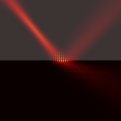
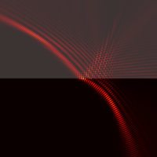
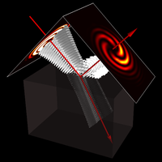
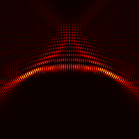

# Optical-beams-MEEP

FDTD simulation of reflection and refraction of polarised optical beams at plane and curved dielectric interfaces based on [Meep](https://github.com/stevengj/meep) as underlying FDTD simulation software package. A mathematical description of the currently implemented beam profiles is outlined in this [Jupyter notebook](https://github.com/DanielKotik/Optical-beams-MEEP/blob/master/beam_profiles.ipynb).

The provided files (and features) are:
*   Scheme configuration file for Gaussian beams (2d) impinging upon planar, concave and convex dielectric interfaces
*   Scheme configuration file for Laguerre-Gaussian (vortex) beams (3d) impinging upon a planar dielectric interface
*   Python scripts for enhanced visualisation and analysis of the generated HDF5 output files
*   The waist/focus of the beams can be placed anywhere along the propagation direction - independently of the location of the source current distribution

Originally, these files have been used in studying optical beam shifts providing independent numerical simulations. With regards to their scriptability, together with the ease and widespread use of the powerful [Meep](https://github.com/stevengj/meep) tool, these scripts can easily be adapted to other and possibly more complicated beam/interface setups.

## Invocation
A Scheme configuration file (extension ``.ctl``) may be launched with the serial or parallel version of Meep and with parameters specified via command line arguments, for example by executing commands like (notice the single quotes to specify strings and Scheme expressions):

``mpirun -quiet -np X meep-mpi interface='"concave"' Gauss2d.ctl``

or

``mpirun -quiet -np X meep-mpi n2=1.5 e_z='(/ 1+1i 2)' e_y='(/ 1-1i 2)' LaguerreGauss3d.ctl``

with ``X`` indicating the number of cores. All possible Meep parameters that can be set from the command line are
defined in expressions beginning with ``(define-param ...`` in the respective configuration files.

## Visualisation
The generated HDF5 files can be processed by different visualisation tools. To get a quick impression of the data
[Meep](https://github.com/stevengj/meep) comes bundled with the [h5utils](https://github.com/stevengj/h5utils)
programs. Utilising these tools, visualisation is fairly easy performed by issuing for example the following commands:

_for 2d simulations_
``h5topng -S2 -Zc dkbluered -a gray -A eps-000000000.h5 ez-000003696.h5`` (real part of the field pattern, optical
denser material is shaded in grey)

``h5topng -S2 -c hot -a yarg -A eps-000000000.h5 e2_s-000003696.h5`` (intensity distribution, optical
denser material is shaded in grey)

_for 3d simulations_
``h5topng -S2 -0 -z 0  -c hot e_real2_p-000001500.h5`` (slice within the plane of incidence)

``h5topng -S2 -x INDEX -c hot e_real2_p-000001500.h5`` (slice transversal to the incident propagation axis with INDEX specifying the slice index)

``h5tovtk e_real2_p-000001500.h5`` (creates a VTK file to be opened by e.g. the [MayaVi](https://github.com/enthought/mayavi) or [ParaView](https://github.com/Kitware/ParaView) visualisation application)

The [Meep Scheme tutorial](https://meep.readthedocs.io/en/latest/Scheme_Tutorials/Basics/) provides further useful
information and assistance.
For a more detailed explanation of our configuration files and the physical background, please see my dissertation thesis. Coming soon.

## Supported beams, interfaces and polarisation configurations
-   [x] Gaussian beams (2d), planar, s- and p-polarisation
-   [x] Gaussian beams (2d), concave, s- and p-polarisation
-   [x] Gaussian beams (2d), convex, s- and p-polarisation
-   [x] Laguerre-Gaussian (vortex) beams (3d), planar, arbitrary complex polarisation
-   [x] Airy beams (2d), planar, s- and p-polarisation

## Citing
If you use code from this repository in a published work, please cite the DOI
corresponding to the specific version of **Optical-beams-MEEP** that you used
(DOIs are listed at [Zenodo.org](https://zenodo.org/)).
